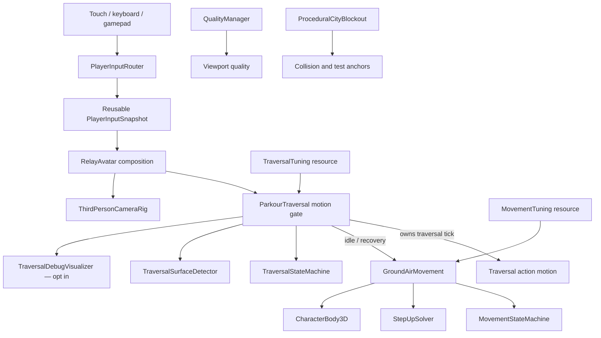

# Architecture

## Principle

The player scene is a composition root, not a giant controller. Device input becomes intent, independent movement/traversal modules simulate behavior, the body owns collision, and presentation systems observe state.

## Current modules

| Module | Owns | Must not own |
|---|---|---|
| `PlayerInputRouter` | Keyboard/touch/gamepad sampling into one reusable typed snapshot | Physics, camera transforms, combat rules |
| `MovementTuning` | Central speeds, response, gravity, slope, step, landing, and rotation values | Device input, live body state |
| `GroundAirMovement` | Ground/air acceleration, gravity, jump buffer/coyote time, landing detection, temporary burst | Device events, animation graph, camera |
| `MovementStateMachine` | Semantic locomotion/air/landing states and recovery windows | Velocity integration, input sampling |
| `StepUpSolver` | Wall-contact-gated, height-bounded step validation | General parkour, mantling, arbitrary teleportation |
| `TraversalTuning` | Central detection, wall run/climb, wall jump, vault, mantle, ledge, recovery, momentum, and pose values | Live body state, input sampling |
| `TraversalStateMachine` | One mutually exclusive traversal state, legal transition table, elapsed time, reasons, diagnostics | Physics queries or velocity integration |
| `TraversalSurfaceDetector` | Bounded reusable ray/shape queries, wall/top/landing geometry, authored valid/invalid surface policy, clearance | Action selection or scripted movement |
| `ParkourTraversal` | Contextual intent interpretation, action motion ownership, momentum handoff, anti-chain limits | Device events, camera orbit, world authoring |
| `TraversalDebugVisualizer` | Debug-only rays, normals, targets, state/speed/velocity/surface HUD | Release gameplay logic or always-on queries |
| `ThirdPersonCameraRig` | Orbit/follow, collision, recentering, speed response, subtle traversal framing without forced yaw | Player locomotion decisions |
| `RelayAvatar` | Module composition and physics tick ordering | Future missions, save data, UI construction |
| `QualityManager` | Quality-tier selection and viewport knobs | Per-feature gameplay logic |
| `TouchInputOverlay` | Independent touch IDs, virtual stick, drag surface, action buttons | Movement simulation |
| `ProceduralCityBlockout` | Preserved Milestone 0 package-smoke collision/geometry | Production streaming or mission state |
| `MovementTraversalLab` | Purpose-tagged M1 movement and M2 parkour graybox, routes, invalid cases, deterministic markers | Production city layout or decoration |
| `Milestone1TestRunner` | Runtime movement/camera/input acceptance and process exit status | Shipping gameplay behavior |
| `Milestone2TestRunner` | Runtime traversal/detection/momentum/recovery/debug acceptance in a separate process | Shipping gameplay behavior |

## Motion ownership contract

Each physics tick has one authoritative owner:

1. `RelayAvatar` samples one reusable `PlayerInputSnapshot` and computes camera-relative intent.
2. `ParkourTraversal` advances its exclusive state. Wall/scripted states return ownership; `GroundAirMovement` does not integrate that tick.
3. Idle or recovery traversal states return ownership to the preserved M1 `GroundAirMovement` immediately.
4. Completed vault/mantle/ledge actions hand forward momentum back through body velocity rather than resetting speed.
5. Camera and presentation observe traversal state after physics intent is resolved; they do not select traversal actions.

This prevents contradictory wall-run/mantle/ground integration from operating simultaneously while keeping normal movement independent and unchanged.

## Traversal surface authoring contract

- Only stable `StaticBody3D` nodes explicitly tagged `traversal_surface` are candidates.
- `traversal_invalid` always wins, even on otherwise plausible walls.
- Floors, ceilings, shallow normals, one-probe/tiny geometry, foreign top colliders, blocked standing capsules, and missing landing space reject.
- Low obstacle, wall, top, hang, mantle, and vault destinations are derived from collision results and verified before action start.
- Dynamic/moving traversal surfaces and separately linked facade/roof colliders are deferred until they receive explicit IDs, velocity handoff, and tests.

## Planned domain boundaries

Each major domain gets its own directory, tests, data resources, and narrow public interface:

- `traversal`: future dive, aerial tricks, and progression extensions around the current parkour motion gate;
- `swing`: anchors, tether constraint, reel/release, dual-tether extension;
- `parkour`: current wall/vault/mantle/ledge actions live under `traversal`; future animation authoring remains separate;
- `animation`: locomotion state, pose matching, IK, additive tricks, hit reactions;
- `combat`: targeting, combo state, hit validation, aerial combat, finish conditions;
- `abilities`: cooldowns, energy, upgrades, contextual powers;
- `customization`: suit parts, palettes, material parameters, loadouts;
- `ai`: perception, navigation, combat brains, crowd/traffic policies;
- `missions`: objectives, checkpoints, rewards, fail/retry flow;
- `ui`: menus, HUD, accessibility, input prompts;
- `audio`: events, mixing, traversal wind, world zones, dialogue playback;
- `saving`: versioned profiles, migration, settings, progression;
- `world_streaming`: cell lifecycle, budgets, persistence, navigation data;
- `graphics`: tier definitions, runtime adaptation, platform overrides.

## Dependency rules

1. Input modules emit intent; gameplay modules never query touch widgets.
2. Movement/swing/parkour write through one authoritative motion coordinator so systems cannot fight over velocity.
3. Animation reads semantic state and may request bounded root-motion actions; it does not decide mission/combat outcomes.
4. Combat consumes traversal state through read-only snapshots and explicit impulses.
5. Missions invoke public gameplay events and own no low-level locomotion code.
6. Saving serializes versioned data resources, never live scene nodes.
7. Graphics quality can reduce presentation density but cannot change deterministic gameplay outcomes.
8. World streaming exposes stable entity IDs so missions and saving do not retain freed node references.

## Testing layers

| Layer | Example | Gate |
|---|---|---|
| Pure/deterministic | Velocity, tether math, state transitions | Fast headless tests |
| Scene integration | Player + camera + collision + input router | Headless or desktop smoke scene |
| Package/static | Manifest, ABI, SDK, signing, alignment | Every Android artifact |
| Device functional | Touch, orientation, suspend/resume, audio | At least two hardware tiers |
| Device performance | Sustained route, combat stress, streaming stress | Per quality tier before dependency growth |

No downstream domain may treat an upstream prototype as production-ready until its relevant gate passes.
