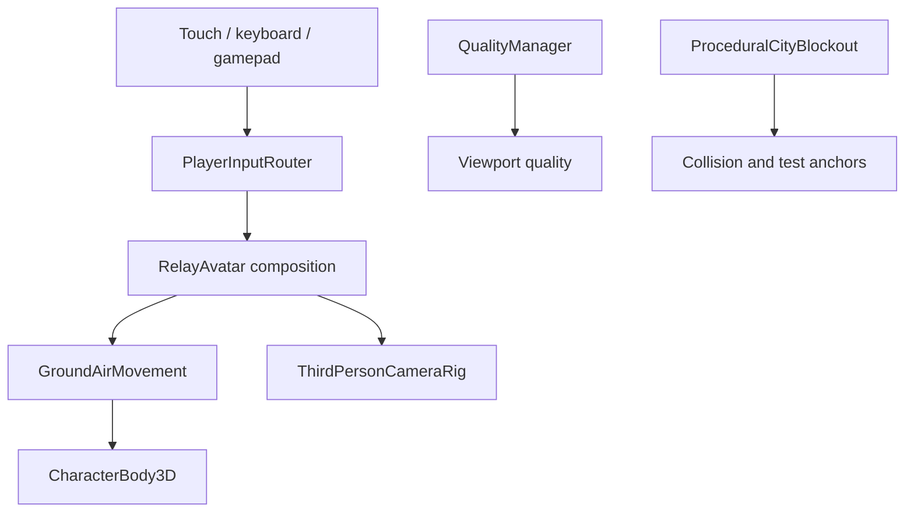

# Architecture

## Principle

The player scene is a composition root, not a giant controller. Device input becomes intent, independent movement/traversal modules simulate behavior, the body owns collision, and presentation systems observe state.

## Current modules

| Module | Owns | Must not own |
|---|---|---|
| `PlayerInputRouter` | Action sampling, touch intent, one-shot requests | Physics, camera transforms, combat rules |
| `GroundAirMovement` | Ground/air acceleration, gravity, jump, temporary burst | Device events, animation graph, camera |
| `ThirdPersonCameraRig` | Orbit input and follow presentation | Player locomotion decisions |
| `RelayAvatar` | Module composition and physics tick ordering | Future missions, save data, UI construction |
| `QualityManager` | Quality-tier selection and viewport knobs | Per-feature gameplay logic |
| `TouchInputOverlay` | Touch regions, virtual stick, action buttons | Movement simulation |
| `ProceduralCityBlockout` | Deterministic test collision/geometry | Production streaming or mission state |
| `SmokeTestRunner` | Acceptance probes and process exit status | Shipping gameplay behavior |

## Planned domain boundaries

Each major domain gets its own directory, tests, data resources, and narrow public interface:

- `traversal`: shared motion state, dive, aerial tricks, momentum accounting;
- `swing`: anchors, tether constraint, reel/release, dual-tether extension;
- `parkour`: vault, mantle, wall run, wall climb, ledge transitions;
- `animation`: locomotion state, pose matching, IK, additive tricks, hit reactions;
- `combat`: targeting, combo state, hit validation, aerial combat, finish conditions;
- `abilities`: cooldowns, energy, upgrades, contextual powers;
- `customization`: suit parts, palettes, material parameters, loadouts;
- `ai`: perception, navigation, combat brains, crowd/traffic policies;
- `missions`: objectives, checkpoints, rewards, fail/retry flow;
- `ui`: menus, HUD, accessibility, input prompts;
- `audio`: events, mixing, traversal wind, world zones, dialogue playback;
- `saving`: versioned profiles, migration, settings, progression;
- `world_streaming`: cell lifecycle, budgets, persistence, navigation data;
- `graphics`: tier definitions, runtime adaptation, platform overrides.

## Dependency rules

1. Input modules emit intent; gameplay modules never query touch widgets.
2. Movement/swing/parkour write through one authoritative motion coordinator so systems cannot fight over velocity.
3. Animation reads semantic state and may request bounded root-motion actions; it does not decide mission/combat outcomes.
4. Combat consumes traversal state through read-only snapshots and explicit impulses.
5. Missions invoke public gameplay events and own no low-level locomotion code.
6. Saving serializes versioned data resources, never live scene nodes.
7. Graphics quality can reduce presentation density but cannot change deterministic gameplay outcomes.
8. World streaming exposes stable entity IDs so missions and saving do not retain freed node references.

## Testing layers

| Layer | Example | Gate |
|---|---|---|
| Pure/deterministic | Velocity, tether math, state transitions | Fast headless tests |
| Scene integration | Player + camera + collision + input router | Headless or desktop smoke scene |
| Package/static | Manifest, ABI, SDK, signing, alignment | Every Android artifact |
| Device functional | Touch, orientation, suspend/resume, audio | At least two hardware tiers |
| Device performance | Sustained route, combat stress, streaming stress | Per quality tier before dependency growth |

No downstream domain may treat an upstream prototype as production-ready until its relevant gate passes.
