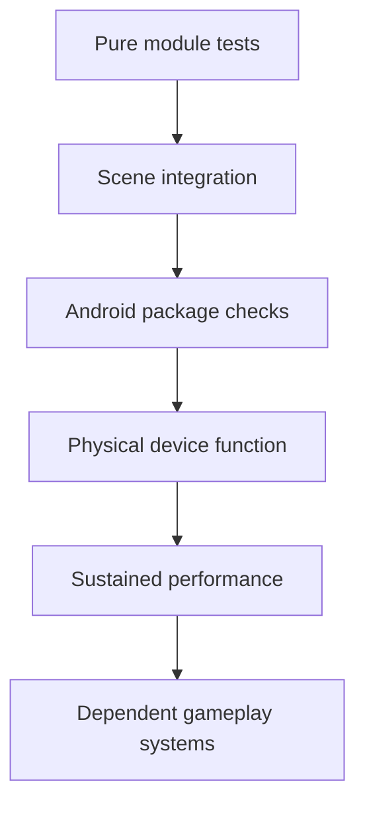

# Test plan

## Test order

Do not build systems represented to the right of a failed gate.

## Milestone 0 checks

| Check | Method | Result |
|---|---|---|
| Engine launch | Godot 4.6.3 headless version/editor startup | Pass |
| Project import | Headless editor import, all scripts/scenes loaded | Pass |
| Scene boot | Main scene in headless Mobile rendering mode | Pass |
| World setup | Count nodes in `city_building` group | Pass: 16 |
| Quality setup | Find quality manager and apply default tier | Pass: MEDIUM, scale 0.78 |
| Locomotion | Drive touch intent for 24 physics frames | Pass: 3.23 m |
| Jump | Request touch jump and inspect upward velocity | Pass: 10.50 m/s |
| Burst probe | Request touch burst and inspect horizontal speed | Pass: 22.16 m/s |
| APK build | Godot official prebuilt Android debug template | Pass |
| Manifest | `aapt2 dump badging/xmltree` | Pass: expected package, API 36 target, landscape launcher |
| ABI | `aapt2 dump badging` and ZIP listing | Pass: arm64 only |
| Signature | `apksigner verify --verbose` | Pass: v2 and v3 |
| ZIP/page packaging | `zipalign -c -P 16 -v 4` | Pass |
| Native LOAD alignment | `readelf -lW` | Pass: all LOAD segments `0x4000` |
| Archive | `unzip -t` | Pass |
| Physical install/launch | Connected Android hardware | Not run; blocked by environment/device availability |

## Device functional matrix for the M1 entry gate

Run on at least one LOW-class and one MEDIUM-class arm64 phone:

- clean install and launch;
- correct landscape orientation and safe-area layout;
- multitouch movement/look/action-button combinations;
- suspend, resume, screen lock, incoming interruption, and relaunch;
- no unintended permissions;
- controller connection/disconnection if supported;
- thermal state and battery behavior over 15 minutes;
- 4 KB and, when available, 16 KB page-size runtime;
- uninstall/reinstall and signing-key behavior.

Record model, SoC/GPU, RAM, OS/API, refresh rate, page size, build hash, quality tier, test duration, average/percentile frame time, peak memory, and every defect.

## Traversal test requirements for M1

- Anchor query rejects invalid/occluded/out-of-range surfaces deterministically.
- Tether length constraints remain stable across frame rates.
- Release velocity conserves designed momentum within a documented tolerance.
- Dive-to-swing speed gain is bounded and reproducible.
- Camera rotation never changes physics intent unexpectedly.
- Wall/ledge transitions have explicit cancellation and recovery states.
- Touch inputs work with two thumbs and do not depend on button focus.
- A repeatable city route catches tunneling, snagging, camera clipping, and speed instability.

Only after these pass should combat or mission design depend on traversal state.
