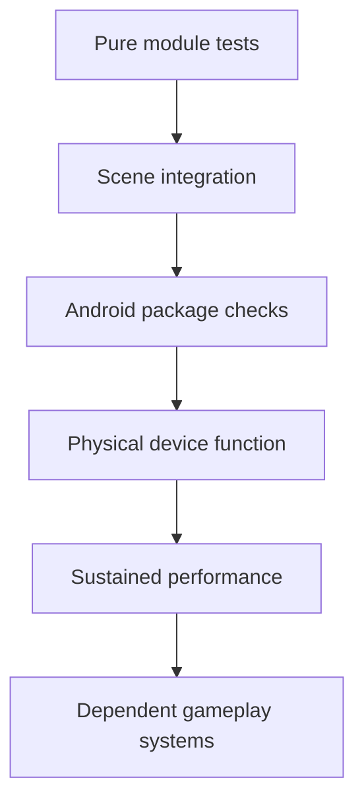

# Test plan

## Test order

Do not build systems represented to the right of a failed gate.

## Milestone 0 checks

| Check | Method | Result |
|---|---|---|
| Engine launch | Godot 4.6.3 headless version/editor startup | Pass |
| Project import | Headless editor import, all scripts/scenes loaded | Pass |
| Scene boot | Main scene in headless Mobile rendering mode | Pass |
| World setup | Count nodes in `city_building` group | Pass: 16 |
| Quality setup | Find quality manager and apply default tier | Pass: MEDIUM, scale 0.78 |
| Locomotion | Drive touch intent for 24 physics frames | Pass: 3.23 m |
| Jump | Request touch jump and inspect upward velocity | Pass: 10.50 m/s |
| Burst probe | Request touch burst and inspect horizontal speed | Pass: 22.16 m/s |
| APK build | Godot official prebuilt Android debug template | Pass |
| Manifest | `aapt2 dump badging/xmltree` | Pass: expected package, API 36 target, landscape launcher |
| ABI | `aapt2 dump badging` and ZIP listing | Pass: arm64 only |
| Signature | `apksigner verify --verbose` | Pass: v2 and v3 |
| ZIP/page packaging | `zipalign -c -P 16 -v 4` | Pass |
| Native LOAD alignment | `readelf -lW` | Pass: all LOAD segments `0x4000` |
| Archive | `unzip -t` | Pass |
| Physical install/launch and basic controls | Manual user test on a real Android phone | User-reported pass: install, launch, landscape, movement, right drag, JUMP, BURST, no immediate crash; hardware/performance details not reported |

## Device functional matrix

Run on at least one LOW-class and one MEDIUM-class arm64 phone:

- clean install and launch;
- correct landscape orientation and safe-area layout;
- multitouch movement/look/action-button combinations;
- suspend, resume, screen lock, incoming interruption, and relaunch;
- no unintended permissions;
- controller connection/disconnection if supported;
- thermal state and battery behavior over 15 minutes;
- 4 KB and, when available, 16 KB page-size runtime;
- uninstall/reinstall and signing-key behavior.

Record model, SoC/GPU, RAM, OS/API, refresh rate, page size, build hash, quality tier, test duration, average/percentile frame time, peak memory, and every defect.

## Milestone 1 core-movement automated matrix

| Area | Probe | Accepted result |
|---|---|---|
| Architecture | Required modules, nine states, tuning resource, reusable input snapshot | Pass |
| Walk/jog/sprint | Analog 0.30, full input, sprint hold | 2.43 / 7.20 / 11.80 m/s |
| Acceleration/deceleration | First stopping frame then settle | Pass: no snap; settles below 0.15 m/s |
| Camera-relative movement | Camera faces world-right, stick forward | Pass: 4.66 m primarily world +X |
| Fixed physics rate | Identical 1.5 s sprint at 30 and 60 Hz | 16.060 / 15.965 m; 0.095 m delta |
| Direction reversal | 24 alternating four-frame inputs | Pass: 2.53 m/s peak, 0.48 m drift |
| Jump/air | Sprint jump, air steer, repeated buffered requests | Pass: 9.93 m/s vertical, 11.80 m/s horizontal, 0.51 m steer, five jumps |
| Landing | Medium/high drop and roof run-off | Pass: 12.35 m/s soft, 24.05 m/s hard, falling/landing states |
| Steps/stairs/slopes | 0.10/0.20/0.32/0.48 m steps, stairs, 18°/38°/55° ramps | Pass: supported heights climb; 0.48 m and 55° reject |
| Walls/platforms | Blocking wall and 1.35 m narrow platform | Pass: no penetration or material lateral drift |
| Camera collision | Three-wall compression bay then open flat | Pass: arm ratio 0.38 obstructed / 1.00 clear |
| Aspect layout | 16:9, 20:9, 19.5:9, 16:10, 4:3 | Pass: controls remain in bounds and separated |
| Simultaneous touch | Independent move/look IDs plus jump one-shot | Pass |
| Camera orbit | Extreme pitch inputs and requested recenter | Pass: -55° to +24°, stable travel-target recenter |
| M0 regression | Move, jump, temporary BURST | Pass: 2.26 m / 9.93 m/s / 19.44 m/s |

## Milestone 1 physical-device gate

Follow the ten-part checklist in [M1_ACCEPTANCE.md](M1_ACCEPTANCE.md). Automated 30/60 Hz physics consistency is not a substitute for Android frame-rate, touch-latency, thermal, or driver evidence.

Only after physical feedback is reviewed and major movement/camera defects are fixed may swinging or other superhero traversal begin. Combat remains later.
